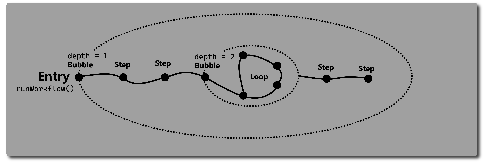
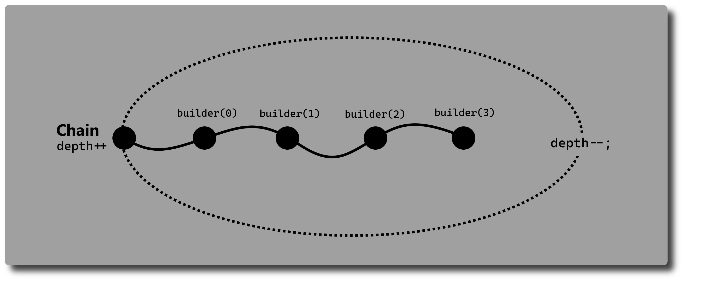

> Note, that Stepflow isn't really finished. 
> I released it as 1.0 because I didn't really thought about it and 
> then I let the version number untouched. After I got actual downloads I realized, 
> I should care about the versioning of the package.
> 
> Therefore, I will stay with this flaw, 
> and I'm going to release the first 2.0 version whenever 
> the interface is stable and other packages should be able
> to depend on Stepflow.

If you depend on Stepflow below version 2.0, 
you should be aware of interface changes.

# Stepflow - Modular workflow composition
[](https://github.com/zopnote/stepflow/actions/workflows/dart-project-quality.yml)


A Dart package for building modular workflows. 
It introduces step-based composition, where each step is a self-contained unit of logic or interaction. 
The structure makes it easier to break down processes to into more reusable steps. Improving clarity, 
testability, and maintainability of toolchains or workflows. It's like Flutter but for workloads.

You can use Stepflow in every Dart project:
````bash
dart pub add stepflow
````

## Common workflow design
A workflow in Stepflow consists of a chain of ``Step``s, which are
able to manipulate their own execution order and behaviour.
At first this seems to not evaluate the aspects that are important and
better driven by single responsibility. But through the design a workflow
can have states and is able to respond to different situations.
This opens the way for the most important step. 
The ``Bubble extends Step``, that contains logic about 
the execution of steps inside of it.

The ``Chain`` step is also just
a bubble with an indexed ``builder()``-function
or the ``Loop`` step is a bubble which repeatedly execute its steps.
A workflow is started inside a ``Bubble``.
With ``context.pop()`` you can always escape the current bubble
directly with an error message. With ``context.close()`` you can exit all bubbles.
If you want an own behaviour of execution,
you should create a subclass of ``Bubble``.

Furthermore, Stepflow has the ``ConfigureStep``, that is quite the same as a ``Widget`` for and in Flutter.
It is a step, that will atomize itself into the steps, it is composed of. Because a workflow is also just
a step itself, you create it as one. You can find example for workflows and steps [here](examples). Just as you
would expect, a ``ConfigureStep`` has to be extended and it`s ``configure()``-function should be overridden.
It returns then the composition of steps. A list and explanation of the common steps can be found in the GitHub wiki.


## CLI
Stepflow also comes with framework-like-styled glue code for CLI commands and flags.
A ``Command`` consists of at least the following settings:
* use - _The name of the command_
  * If the command is the base of the application the ``use`` has just ascetic purpose 
    other than describing in the syntax.
* description - _Useful information about the command_
* flags - _A list of ``Flag`` that will be parsed from the command line and then added to the ``CommandInformation``_
* run function - _Whatever the command should do_
  * Has to return a ``Response``, that will be printed out to std.
  * The ``CommandInformation`` holds the data of the current command and it's processing.
  * ``run()`` can be async

For more documentation about ``Command`` look inside the [documentation in the source files](lib/cli/command.dart).
